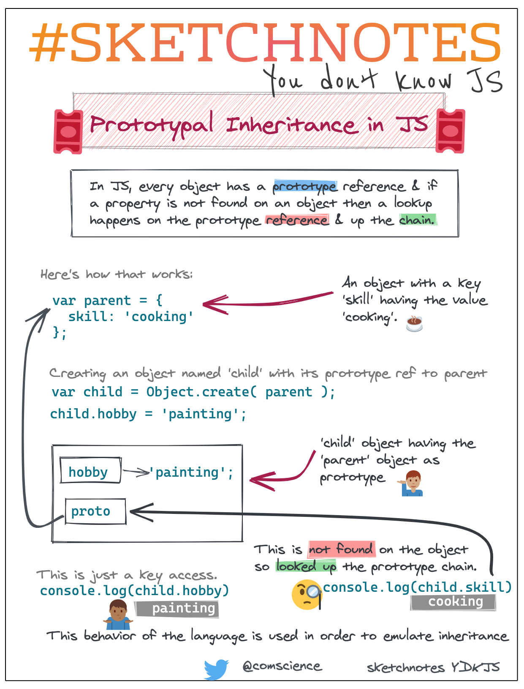

# Resources

## CSS

* [A guide to CSS units — pt. 1: look at these absolute units!](https://www.peerigon.com/en/blog/complete-guide-to-css-units-series-part-1-absolute-units)

## Javascript

* [Introducing Javascript Objects](https://developer.mozilla.org/en-US/docs/Learn/JavaScript/Objects)
* [Javascript Classes — Under The Hood](https://medium.com/tech-tajawal/javascript-classes-under-the-hood-6b26d2667677)
* [Master the JavaScript Interview: What’s the Difference Between Class & Prototypal Inheritance?](https://medium.com/javascript-scene/master-the-javascript-interview-what-s-the-difference-between-class-prototypal-inheritance-e4cd0a7562e9)
* [Making asynchronous programming easier with async and await](https://developer.mozilla.org/en-US/docs/Learn/JavaScript/Asynchronous/Async_await)

## Node

* [Server-side website programming first steps](https://developer.mozilla.org/en-US/docs/Learn/Server-side/First_steps)

## Helpful Snippets

* [One Line of Code](https://1loc.dev/)

## Videos

* [Net Ninja: Node JS Tutorial for Beginners](https://www.youtube.com/playlist?list=PL4cUxeGkcC9gcy9lrvMJ75z9maRw4byYp)

## Prototypes vs Class

