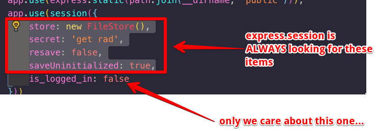
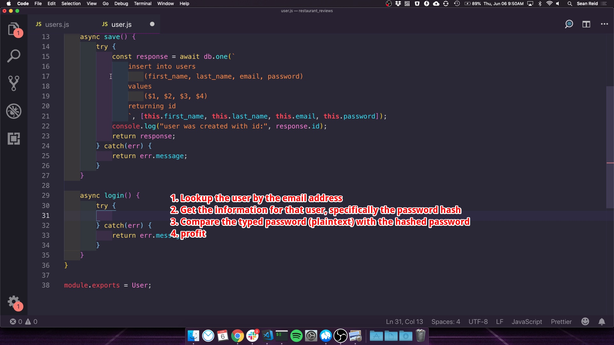

# Resources

## Career Help

* [Your first projects as a new developer](https://johnmosesman.com/post/types-of-projects/)

## User Authentication

* [Learn how to handle authentication with Node using Passport.js](https://www.freecodecamp.org/news/learn-how-to-handle-authentication-with-node-using-passport-js-4a56ed18e81e/)   _REALLY_ helpful if you want to integrate third party logins!
* [bcrypt-ruby](https://github.com/codahale/bcrypt-ruby#how-bcrypt-works) This is a Ruby library, but the README has some great information on how bcrypt works. It's also a nice intro to using a library with a different language.

## Supplemental Screenshots

---
Express JS Session Variables:

---
Steps to validate a user login:

